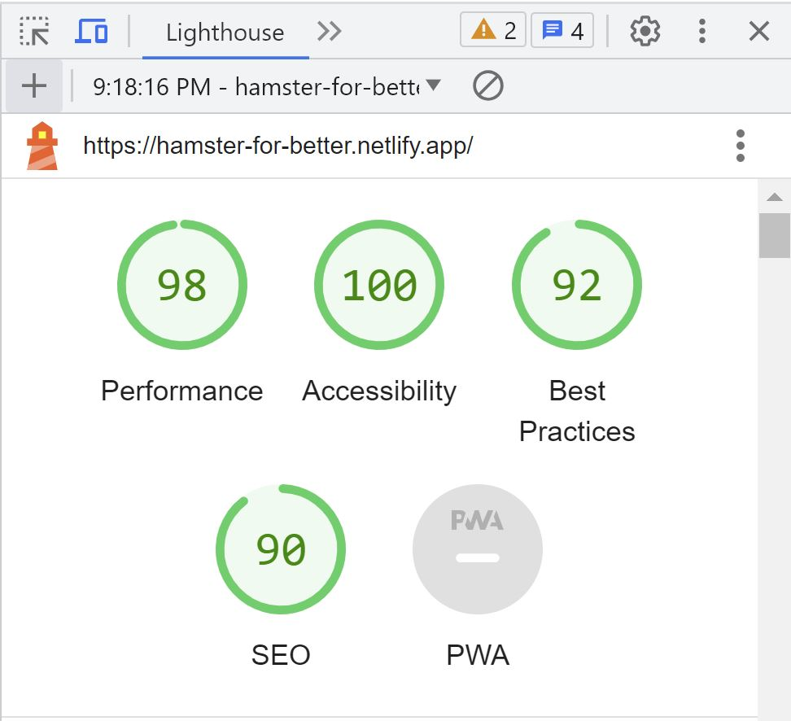

# Documentation for Hamster for Better Website

This Website will consists of home, articles, about, and contact us **navigations menu which are hidden by hamster stack hamburger small menu button**. Despite that, this site display **header, hamsters photos from each kinds, things to know about hamsters, hamster video throuh a youtube embeded video and finally form subission for hamster adoption request**. _Functionality of this site wil be updated later on if there is enough time to do that_.

## Github Repository, Profile Web Domain, Image Sample, and Media Query
[link for Hamster Deserves Better Website github repository](https://github.com/RevoU-FSSE-2/week-2-andalanaldi.git)

[link for Hamster Deserves Better domain](https://hamster-deserves-better.netlify.app/)

If you cannot find the domain link here is the link (a reminder for the author too):
[https://hamster-for-better.netlify.app/]

**This site is intended for tablet or desktop screens with minimun width is 768px**. Hence, please open this site from a tablet or PC desktop / laptop with minimum screen 768px width. 

**This site is continuation from week 2 task to week 3 task**. In week 3 author apply custom font using @font-face, text-shadow, responsive background image using object-fit : cover for picture, srcset and source tag and element, create asymmetrical grid, add date and local date element, and last but not the least, author add animation and transition for h1 and its p tags. After that, Author assesss the site performance through google lighthouse using inspect. Here is the screenshot of the results:

(hamster for better google lighthouse performance 2.JPG)

Because the screenshots could not be loaded. Author will mention each of scores here:

Accessibility : 100;
Best Practices : 92;
SEO : 90;
Performance : 98

If there is a time for update for sure this documentation will be updated.

